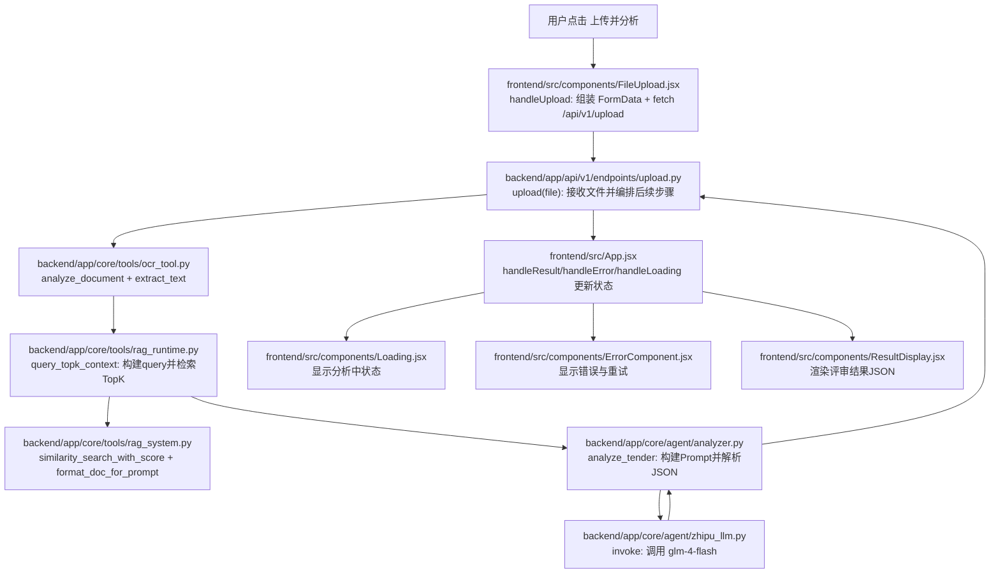
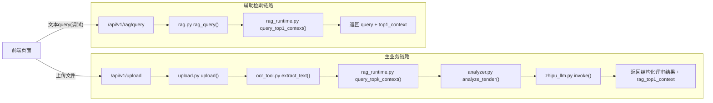

# 一次查询流转流程图（前端到后端）

这份文档面向第一次接触项目的人，目标是回答三个问题：

1. 用户点击一次“上传并分析”后，代码到底走了哪些文件？
2. 每个文件负责什么，输入输出是什么？
3. 主流程和辅助流程（`/rag/query`）有什么区别？

---

## 先看结论

- 这个项目当前“查询”的主入口是前端上传 PDF，然后请求 `POST /api/v1/upload`。
- 后端收到文件后，会经过 OCR 抽取文本、RAG 检索参考业绩、LLM 评分分析，最后返回结构化 JSON 给前端展示。
- `POST /api/v1/rag/query` 是辅助接口，只做 RAG Top-1 检索，不做 LLM 评分。

---

## 主链路流程图（用户真实业务路径）

---

## 分支流程图（`/upload` vs `/rag/query`）

---

## 文件职责清单（按执行层级）

### 1) 前端层

| 文件 | 关键函数/组件 | 输入 | 输出 | 作用 |
|---|---|---|---|---|
| `frontend/src/App.jsx` | `handleResult` / `handleError` / `handleLoading` | 子组件回调数据 | `result` / `error` / `loading` 状态 | 页面状态中枢，决定展示加载、错误、结果 |
| `frontend/src/components/FileUpload.jsx` | `handleUpload` | 用户选择的 PDF 文件 | `POST /api/v1/upload` 请求；回调到 `App` | 主触发点，发起一次“查询” |
| `frontend/src/components/Loading.jsx` | `Loading` 组件 | `loading=true` | 加载提示UI | 告知用户正在处理 |
| `frontend/src/components/ErrorComponent.jsx` | `ErrorComponent` | `error` 文本 | 错误提示和重试入口 | 告知失败原因 |
| `frontend/src/components/ResultDisplay.jsx` | `ResultDisplay` / `formatMatchingField` | 后端返回 JSON | 渲染评审状态、得分、剔除清单 | 把结构化结果可视化 |

### 2) API 入口层

| 文件 | 关键函数 | 输入 | 输出 | 作用 |
|---|---|---|---|---|
| `backend/app/main.py` | `app.include_router(...)` | 路由模块 | `/api/v1/*` 对外接口 | 把上传、OCR、RAG 路由挂载到 FastAPI |
| `backend/app/api/v1/endpoints/upload.py` | `upload` | `UploadFile` | 结构化分析 JSON | 主业务接口：编排 OCR + RAG + LLM |
| `backend/app/api/v1/endpoints/rag.py` | `rag_query` / `rag_rebuild` | 文本 query / 重建请求 | Top-1 上下文 / 重建结果 | 辅助检索与维护接口 |

### 3) 后端核心处理层

| 文件 | 关键函数/类 | 输入 | 输出 | 作用 |
|---|---|---|---|---|
| `backend/app/core/tools/ocr_tool.py` | `OCRTool.extract_text` | 文件字节 | 可分析文本 | 统一文本抽取入口（直读/OCR/混合） |
| `backend/app/core/tools/rag_runtime.py` | `ensure_rag_initialized` / `query_topk_context` / `query_top1_context` | 招标文本或 query | RAG 上下文字符串 | 运行时编排：初始化向量库、检索、候选重排 |
| `backend/app/core/tools/rag_system.py` | `RAGSystem` | query + documents | TopK 文档/分数 | 底层向量检索封装（Chroma + Embedding） |
| `backend/app/core/tools/data_preprocessor.py` | `process_project_data_to_documents` | Excel 业绩数据 | `List[Document]` | 把业务表格转为可向量化文档（初始化/回退时使用） |
| `backend/app/core/agent/analyzer.py` | `analyze_tender` | 招标原文 + RAG 上下文 | 结构化结果 `dict` | 组 prompt、调 LLM、解析 JSON |
| `backend/app/core/agent/zhipu_llm.py` | `ZhipuLLM.invoke` | prompt | LLM 文本 | 调用智谱模型 `glm-4-flash` |

---

## 小白版：一次请求到底发生了什么

把系统理解成 4 个工位：

1. **前端接待台**（`FileUpload.jsx`）  
   用户把 PDF 交上来，前端打包后发给后端。

2. **后端资料员**（`ocr_tool.py`）  
   先判断文件类型，再尽可能把可读文字提出来。

3. **后端档案检索员**（`rag_runtime.py` + `rag_system.py`）  
   根据招标文本去历史业绩库里找“最像的参考案例”，并做候选排序。

4. **后端评审专家**（`analyzer.py` + `zhipu_llm.py`）  
   把“招标原文 + 检索到的参考业绩”一起交给模型，让它按规则输出 JSON 评审结果。

最后，前端 `App.jsx` 收到 JSON 后，交给 `ResultDisplay.jsx` 展示；如果处理中就显示 `Loading.jsx`，出错就显示 `ErrorComponent.jsx`。

---

## 关键认知（避免误解）

- 前端目前没有独立“文本查询框”；业务查询等价于“上传文件并分析”。
- `rag_top1_context` 这个返回字段名是历史命名，实际来自 `query_topk_context` 的拼接上下文。
- `/rag/query` 不会给你最终评分结果，只返回检索到的一段参考文本。
